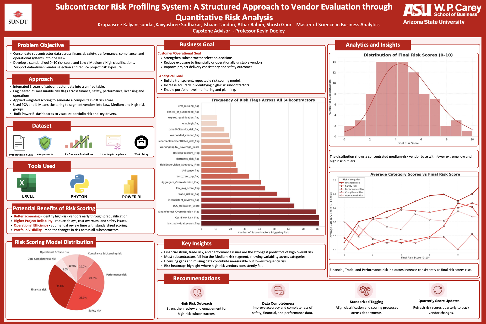

# Subcontractor Risk Profiling System  
### Industry Collaboration Project with Sundt Construction

## Overview

This project was developed in collaboration with Sundt Construction to design a data-driven system for proactively identifying subcontractor risk before it impacts project timelines, safety performance, or financial outcomes.

The objective was to move beyond reactive risk handling and build a structured, explainable risk assessment framework that transforms fragmented operational data into measurable, decision-ready insights.

---

## Problem Statement

Construction projects rely heavily on subcontractors, yet risk assessment is often:

- Manual and reactive  
- Based on fragmented datasets  
- Difficult to interpret or defend  
- Lacking transparency in scoring logic  

This project addresses these challenges by developing a transparent, weighted risk scoring system grounded in real-world construction data.

---

## My Role

I led the Python-based model development, including:

- Designing the core risk framework  
- Defining “risk” within a construction and subcontractor context  
- Engineering measurable risk indicators from raw operational data  
- Building a transparent weighted scoring methodology  
- Ensuring model explainability for executive stakeholders  

---

## Risk Framework Design

Risk indicators were engineered across multiple dimensions:

- **Financial Capacity**
- **Safety Performance**
- **Operational Load**
- **Trade-Specific Risk**
- **Compliance & Licensing**
- **Data Completeness & Reporting Gaps**

These dimensions were transformed into normalized risk signals and combined using a weighted scoring model to produce an overall subcontractor risk score.

---

## Model Characteristics

- Transparent weighted scoring logic  
- Normalized risk indicators  
- Portfolio-level aggregation  
- Executive-aligned risk band classification (Low / Medium / High)  
- Fully explainable output (no black-box scoring)

---

## Dashboard & Visualization

The final output includes an executive-ready Power BI dashboard that enables:

- Individual subcontractor risk scoring  
- Portfolio-level exposure analysis  
- Vendor ranking by risk band  
- Drill-down into specific risk drivers  
- Monitoring of overall subcontractor risk across projects  

The dashboard translates technical model outputs into intuitive visual insights for operational and leadership teams.

---

## Tech Stack

- **Python** – Data preprocessing, feature engineering, risk scoring logic  
- **Power BI** – Executive dashboard development & visualization  
- **Statistical Techniques** – Normalization and weighted scoring framework  

---

## Business Impact

- Enables proactive subcontractor risk identification  
- Improves vendor evaluation transparency  
- Reduces reactive issue management  
- Supports data-driven project governance  
- Enhances portfolio-wide risk visibility  

---

## Future Enhancements

- Machine learning-based dynamic weight adjustment  
- Real-time risk monitoring integration  
- Predictive delay probability modeling  
- Automated compliance validation workflows  

---

## License

This project was developed as part of an academic-industry collaboration.  
Data used in this repository is anonymized for confidentiality.

